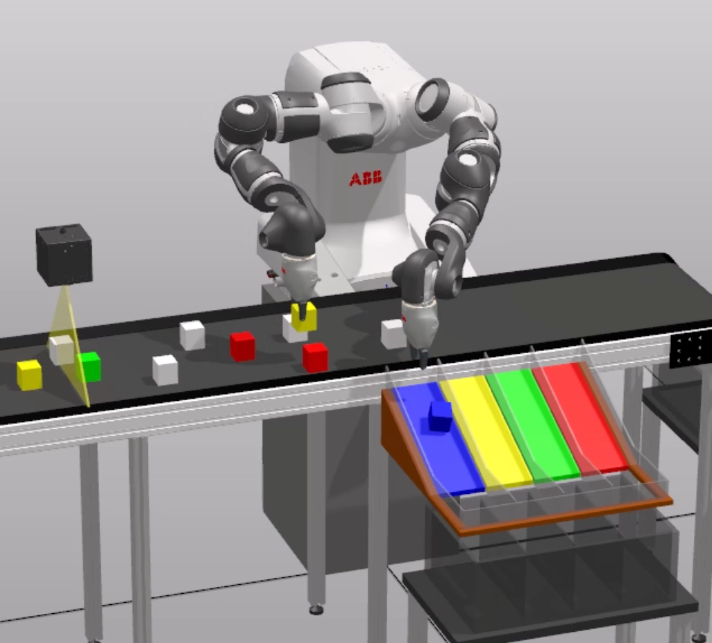

# Two-arms-pick-place-planning of moving-objects

This repository contains the source code accompanying this research:



# Installation
Download the repository and make sure all dependencies are satisfied:

    pip install -r requirements

# Introduction

This article tackles the challenge of automating the pick-and-place operation of multiple moving objects by a dual-arm robot while avoiding collisions between manipulators and minimising the execution time. The system is able to generate each robot’s trajectory to complete the task in the minimum time. This application is addressed from the mathematical framework of Markov Decision Processes (MDP). To do so, the workspace has been discretized to get a finite set of states connected by a set of actions. This work is focused on automation of industrial production and uses Reinforcement Learning to achieve high level of performance and flexibility. In this study, the model is tailored to suit a deterministic setup, where a single agent oversees the entire operation and enjoys full visibility into the system. The result is a methodology for using MDPs in time-changing processes which, when applied to bimanual manipulation, provides the following advantages: It devises optimal trajectories for completing tasks satisfactorily; Accounts for collision avoidance between manipulators and; Automatically generates robot code compatible with different manufacturers. The outcome fulfils the outlined objectives, yielding a robust solution.

# Pseudo-code to emulate system model behaviour

This algorithm shows the pseudocode that outlines the reasoning used to identify the necessity of a new subproblem and the implementation of the calculated plan to resolve this subproblem. Initially, there are no pieces in the workspace area, hence there is no subproblem defined and the robots keep in idle state. The algorithm operates at the granularity of the time step. At each time step, the algorithm dispatches the subsequent action (line 24) for the robots from the existing plan, if available. If specific criteria are fulfilled, the whole plan is redeveloped (line 14), and the system performs the updated plan.

```
1:     // Initially, there is not any plan active (robots keep idle)
 2:     time_step = 0
 3:     plan = None
 4:     plan_max_pieces = N		// N = 2 chosen for the experiments
 5:     LOOP
 6:	     // Keep track of the pieces already detected and not yet assigned to any subproblem
 7:	     IF new piece/s detected THEN
 8:		add new piece/s to pieces_detected list
 9:	     ENDIF
10:	     // Determine if a new subproblem needs to be generated
11:	     IF pieces_detected list is not empty THEN
12:		IF there is no active plan OR subproblem_num_pieces < plan_max_pieces THEN
13:		    subproblem = createNewsubproblem()
14:		    plan = generateNewPlan(subproblem)
15:		    time_step = 0		// start the new plan
16:	     	ENDIF
17:	     ENDIF
18:	     // Deactivate the plan when is done
19:	     IF plan is completed THEN
20:	          plan = None
21: 	     ENDIF
22:	     // Execute the actions for the corresponding time step in the plan
23:	     IF plan != None THEN
24:	          execute plan step
25:	     ENDIF
26:	     // Prepare for the next time step
27:     ENDLOOP
```

# Change the initial conditions
If you intend to try with different initial conditions, you'll need to edit the code for that.

In the case of value iteration or BFS, you need to specify the new input of the problem (check validation.py). That involves the initial location of the robotos, the intial and final location of the pieces, the action mode and the number of planes in the workspace.

Example:

    # EEs initial position
    armsGridPos = [[6, 4, 0], [8, 0, 0]]
    
    # Pieces (config)
    pieces_cfg = [
        {'start': [ 250, 300, 180],'end'  : [-450, 400, 180],},
        {'start': [-250, 300, 180],'end'  : [ 450, 400, 180],},
        {'start': [  50, 600, 180],'end'  : [-350, 200, 180],},
        {'start': [ -50, 600, 180],'end'  : [ 350, 200, 180],},
        {'start': [-450, 200, 180],'end'  : [ 250, 500, 180],},
        {'start': [ 450, 200, 180],'end'  : [-250, 500, 180],},
        {'start': [-350, 600, 180],'end'  : [ 150, 300, 180],},
        {'start': [ 350, 600, 180],'end'  : [-150, 300, 180],},
        {'start': [ 250, 400, 180],'end'  : [ 450, 500, 180],},
        {'start': [-250, 400, 180],'end'  : [ 350, 300, 180],}
    ]

    # Only orthogonal moves in the horizontal plane are allowed
    num_layers = 1
    action_mode = Cfg.ACTIONS_ORTHO_2D

In the case of PDDL, there is a file definition per use (depending on the action mode and the number of pieces). You need to edit the appropriate one and update initial location of the robots and initial and fina location of the pieces.
